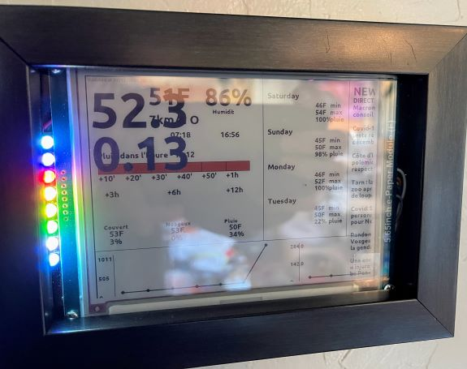

# weather

<a href="images/weatherstation.jpg">

</a>


<a href="https://photos.google.com/u/1/album/AF1QipMrKkpr44q9oncBbR-g1Uv2OszuV5eHCWaLdMhs">photo album</a>

* weather station api details

https://docs.google.com/document/d/1eKCnKXI9xnoMGRRzOL1xPCBihNV2rOet08qpE_gArAY/edit


https://api.weather.com/v2/pws/observations/current?stationId=KCAAPTOS92&format=json&units=e&apiKey=5bb5ecb88c674ef9b5ecb88c67def9fb

result
```
  "observations": [
    {
      "stationID": "KCAAPTOS92",
      "obsTimeUtc": "2021-12-24T05:37:34Z",
      "obsTimeLocal": "2021-12-23 21:37:34",
      "neighborhood": "Seacliff Beach, Aptos",
      "softwareType": "WS-1002 V2.4.5",
      "country": "US",
      "solarRadiation": 0,
      "lon": -121.908257,
      "realtimeFrequency": null,
      "epoch": 1640324254,
      "lat": 36.973396,
      "uv": 0,
      "winddir": 213,
      "humidity": 99,
      "qcStatus": 1,
      "imperial": {
        "temp": 55,
        "heatIndex": 55,
        "dewpt": 54,
        "windChill": 55,
        "windSpeed": 5,
        "windGust": 7,
        "pressure": 29.39,
        "precipRate": 0,
        "precipTotal": 0.45,
        "elev": 115
      }
    }
  ]
}
```

use the lat/long of the station to look up the forcast
https://api.weather.com/v3/wx/forecast/daily/5day?geocode=36.973396,-121.908257&format=json&units=e&language=en-US&apiKey=5bb5ecb88c674ef9b5ecb88c67def9fb

https://www.pwsweather.com/

Cumulus and Meteotemplate 


# openweathermap
b69ed8db8927bd983bf8388c067c5626
api.openweathermap.org/data/2.5/forecast?lat={lat}&lon={lon}&appid={API key}

http://
api.openweathermap.org/data/2.5/forecast?lat=36.973396&lon=-121.908257&appid=b69ed8db8927bd983bf8388c067c5626


```
{
  "cod": "200",
  "message": 0,
  "cnt": 40,
  "list": [
    {
      "dt": 1640336400,
      "main": {
        "temp": 52.75,
        "feels_like": 52.11,
        "temp_min": 50.9,
        "temp_max": 52.75,
        "pressure": 1006,
        "sea_level": 1006,
        "grnd_level": 1003,
        "humidity": 93,
        "temp_kf": 1.03
      },
      "weather": [
        {
          "id": 500,
          "main": "Rain",
          "description": "light rain",
          "icon": "10n"
        }
      ],
      "clouds": {
        "all": 74
      },
      "wind": {
        "speed": 3.96,
        "deg": 133,
        "gust": 8.61
      },
      "visibility": 10000,
      "pop": 0.42,
      "rain": {
        "3h": 0.7
      },
      "sys": {
        "pod": "n"
      },
      "dt_txt": "2021-12-24 09:00:00"
    },
    {

```


## icons
Found a source of images for icons
https://github.com/visualcrossing/WeatherIcons

